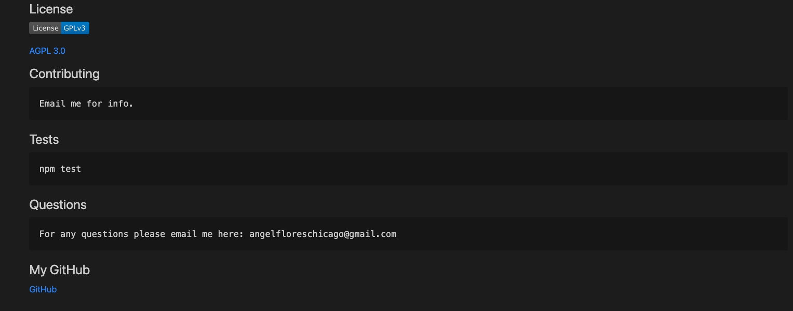

# ReadMe Generator

## Description
    This command line application generates a README.md. This allows developers to save time
    by just answering a few questions about the project they are working on. This application
    deploys with NodeJS and was created using JavaScript and the Inquirer package.

## Scenario
    - Run node index.js on the command line.
    - The user answers the generated questions.
    - After the last question is answered, A README.md file is automatically created and saved.
    - The user opens the new file that has all the questions and information already generated,
      pre-filled and formatted markdown language into the correct categories and spaces. 
    - The user saves time and can continue working on his current or future projects. 

## Video Demo

[Demo](https://drive.google.com/file/d/1a_kseJEmAt5I3nt5UeOFTOb_rmmXFQuu/view?usp=sharing)
Click "Demo" for video demo. 

## License

## Screenshots of README Generator Functionality

